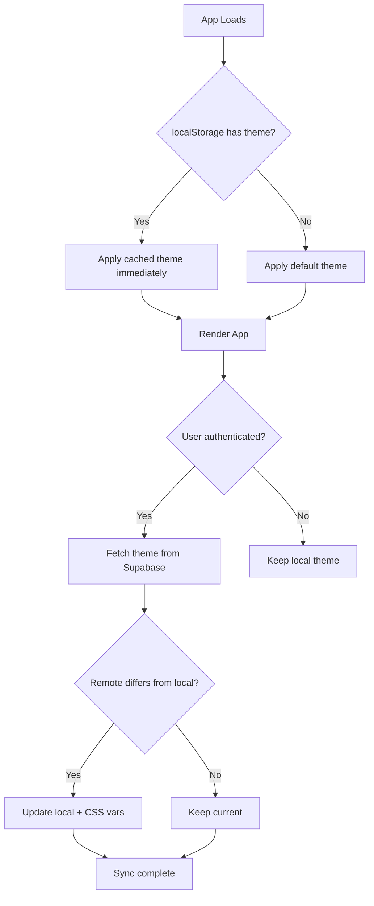

# Custom Theme and User-Configurable Color Palette

## Current State Analysis

The app currently uses:

- **Neon pink (#FF10F0)** as the primary color with glow effects
- Dark charcoal background with trading-app aesthetic
- CSS variables in HSL format (good foundation)
- Chart colors tied to CSS variables via `chartColors` object
- No theme persistence (profiles table only has `currency`)
- Empty ThemeProvider that just returns children

---

## 1. Default Finance-Friendly Color Palette

### Design Rationale

Personal finance apps should evoke:

- **Trust**: Blues and teals (bank-like, stable)
- **Growth**: Soft greens (positive, natural)
- **Calm**: Muted, desaturated tones (not aggressive)
- **Clarity**: High contrast for data readability

Avoid: Neon colors, intense saturation, trading reds/greens dominance.

### Default "Finance Calm" Palette

| Token | Light Mode | Dark Mode | Purpose |

|-------|------------|-----------|---------|

| Primary | `hsl(210, 65%, 45%)` - Steel Blue | `hsl(210, 55%, 55%)` | CTAs, links, focus rings |

| Accent | `hsl(165, 45%, 40%)` - Soft Teal | `hsl(165, 40%, 50%)` | Secondary actions, highlights |

| Positive | `hsl(152, 45%, 42%)` - Sage Green | `hsl(152, 40%, 50%)` | Gains, success states |

| Negative | `hsl(0, 55%, 50%)` - Muted Coral | `hsl(0, 50%, 55%)` | Losses (softer than pure red) |

| Background | `hsl(220, 15%, 97%)` | `hsl(220, 15%, 10%)` | Page background |

| Card | `hsl(0, 0%, 100%)` | `hsl(220, 15%, 13%)` | Card surfaces |

| Muted | `hsl(220, 10%, 94%)` | `hsl(220, 12%, 18%)` | Subtle backgrounds |

### Chart Colors (Finance-Appropriate)

- **Invested**: `hsl(220, 10%, 55%)` - Neutral gray-blue
- **Value**: `hsl(210, 65%, 50%)` - Primary blue (current worth)
- **Positive**: `hsl(152, 45%, 45%)` - Sage green
- **Negative**: `hsl(0, 55%, 55%)` - Muted coral
- **Accents**: Teal, Amber, Purple, Slate variations

---

## 2. CSS Variable Schema

### Structure in [src/index.css](src/index.css)

```css
:root {
  /* Base semantic tokens */
  --background: 220 15% 97%;
  --foreground: 220 15% 10%;
  --primary: 210 65% 45%;
  --primary-foreground: 0 0% 100%;
  /* ... other semantic tokens */

  /* Chart tokens */
  --chart-invested: 220 10% 55%;
  --chart-value: 210 65% 50%;
  --chart-positive: 152 45% 45%;
  --chart-negative: 0 55% 55%;
  --chart-accent-1 through --chart-accent-5

  /* User-customizable tokens (override via inline styles) */
  --user-primary: var(--primary);
  --user-accent: var(--accent);
}

.dark {
  /* Dark mode overrides */
}

/* Preset palette overrides */
[data-palette="neutral"] { ... }
[data-palette="soft-green"] { ... }
[data-palette="warm"] { ... }
```

### Key Principles

- HSL format for all colors (easy programmatic manipulation)
- Semantic naming (not color names)
- User tokens separate from system tokens for safe overrides

---

## 3. Theme Persistence Data Model

### Database Schema Migration

Add to [supabase/schema.sql](supabase/schema.sql):

```sql
-- Add theme preferences to profiles
alter table public.profiles add column theme_preferences jsonb default '{
  "mode": "system",
  "palette": "finance-calm",
  "customColors": null
}'::jsonb;
```

### TypeScript Types

```typescript
interface ThemePreferences {
  mode: 'light' | 'dark' | 'system';
  palette: 'finance-calm' | 'neutral' | 'soft-green' | 'warm' | 'custom';
  customColors?: {
    primary?: string;    // HSL values as "H S% L%"
    accent?: string;
    chartPositive?: string;
    chartNegative?: string;
  } | null;
}
```

---

## 4. Theme Loading Strategy

### Flow Diagram



### Implementation in [src/app/providers/theme-provider.tsx](src/app/providers/theme-provider.tsx)

```typescript
// 1. Blocking script in index.html sets initial theme (no flash)
// 2. ThemeProvider syncs with Supabase after auth
// 3. Theme changes apply CSS vars to :root via style attribute
// 4. localStorage serves as cache for instant load
```

### Anti-Flash Strategy

- Add inline `<script>` in `index.html` that reads localStorage and sets `data-palette` + `class` before React hydrates
- This prevents theme flash on page load

---

## 5. Settings UI Structure

### New Files to Create

- `src/pages/settings.tsx` - Settings page
- `src/features/settings/components/theme-settings.tsx` - Theme section
- `src/features/settings/components/palette-preview.tsx` - Live preview cards
- `src/features/settings/hooks/use-theme.ts` - Theme hook
- `src/features/settings/lib/palettes.ts` - Preset palette definitions

### Settings Page Layout

```
Settings
├── Appearance
│   ├── Color Mode: [Light] [Dark] [System]
│   ├── Color Palette: [Finance Calm] [Neutral] [Soft Green] [Warm]
│   │   └── Preview cards showing each palette
│   └── Advanced (expandable)
│       ├── Primary Color: [preset swatches]
│       ├── Accent Color: [preset swatches]
│       └── [Reset to Default]
└── Other Settings (currency, etc.)
```

### UX Guidelines

- No complex color pickers (preset swatches only)
- Live preview on hover/select
- Clear "Reset to Default" action
- Accessible contrast indicators

---

## 6. How Charts and Components Consume the Theme

### Chart Integration

The existing `chartColors` object in [src/features/calculations/lib/chart-data.ts](src/features/calculations/lib/chart-data.ts) already references CSS variables:

```typescript
export const chartColors = {
  invested: "var(--chart-invested)",
  value: "var(--chart-value)",
  // ... etc
}
```

This architecture is correct. Charts will automatically pick up theme changes when CSS variables update.

### Component Updates Required

1. Remove all `neon-*` classes and hardcoded pink references
2. Replace `shadow-neon-*` with standard subtle shadows
3. Update scrollbar and focus ring styles to use `--primary`
4. Remove `glass-effect` and neon glow utilities

### Files to Modify

- [src/index.css](src/index.css) - Replace color definitions, remove neon utilities
- [tailwind.config.cjs](tailwind.config.cjs) - Remove neon color/shadow definitions
- Components using `shadow-neon-*`, `neon-*` classes (search and replace)

---

## 7. File Structure Summary

```
src/
├── index.css                          # Updated CSS variables + palettes
├── app/
│   ├── App.tsx                        # (unchanged)
│   └── providers/
│       └── theme-provider.tsx         # Full implementation
├── features/
│   └── settings/
│       ├── components/
│       │   ├── theme-settings.tsx     # Theme section UI
│       │   └── palette-preview.tsx    # Palette preview cards
│       ├── hooks/
│       │   └── use-theme.ts           # Theme state management
│       ├── lib/
│       │   └── palettes.ts            # Preset palette definitions
│       └── api/
│           └── theme-api.ts           # Supabase save/load
├── pages/
│   └── settings.tsx                   # Settings page
└── lib/
    └── supabase/
        └── types.ts                   # Updated with ThemePreferences
```

---

## 8. Implementation Order

1. **Database migration** - Add theme_preferences column
2. **Palette definitions** - Create preset palettes in TypeScript
3. **CSS variable schema** - Replace neon theme with finance-calm default
4. **Theme provider** - Implement loading/persistence logic
5. **Anti-flash script** - Add to index.html
6. **Settings page + UI** - Create theme customization interface
7. **Component cleanup** - Remove neon references throughout codebase
8. **Chart verification** - Ensure charts respond to theme changes