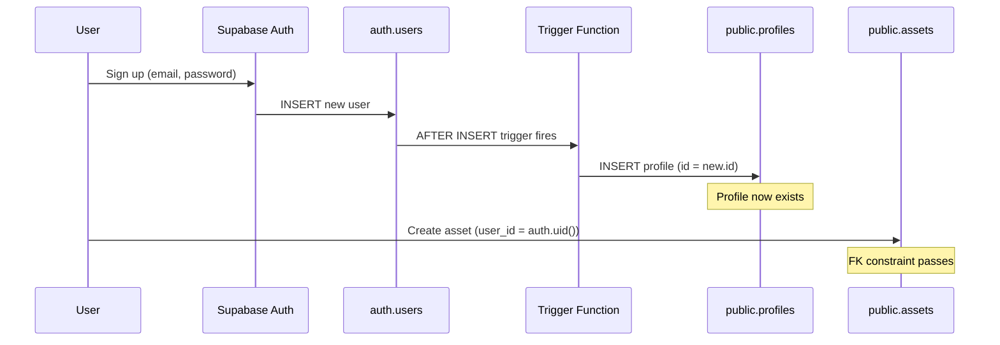

# Fix Foreign Key Constraint Violations

## Problem Analysis

The error `insert or update on table "assets" violates foreign key constraint "assets_user_id_fkey"` occurs because:

1. **Schema Design**: The `assets.user_id` references `public.profiles(id)`, NOT `auth.users(id)` directly:
```sql
-- From schema.sql line 20
user_id uuid references public.profiles(id) on delete cascade not null,
```

2. **Missing Profile Creation**: When a user signs up via Supabase Auth, a record is created in `auth.users`, but **no corresponding profile** is automatically created in `public.profiles`.

3. **Failed Inserts**: When the app tries to insert assets/investments with `user_id = auth.uid()`, the foreign key constraint fails because that UUID doesn't exist in `profiles`.

## Affected Tables

All three user-owned tables have the same issue:

| Table | Foreign Key | Reference |

|-------|-------------|-----------|

| `assets` | `user_id` | `profiles(id)` |

| `investments` | `user_id` | `profiles(id)` |

| `price_history` | `user_id` | `profiles(id)` |

## Solution: Database Trigger

Add a PostgreSQL trigger function that automatically creates a profile record whenever a new user is created in `auth.users`. This is the most reliable approach.

### Changes to [supabase/schema.sql](supabase/schema.sql)

Add the following after the `profiles` table definition (around line 8):

```sql
-- Auto-create profile on user signup
create or replace function public.handle_new_user()
returns trigger
language plpgsql
security definer set search_path = ''
as $$
begin
  insert into public.profiles (id)
  values (new.id);
  return new;
end;
$$;

create trigger on_auth_user_created
  after insert on auth.users
  for each row execute procedure public.handle_new_user();
```

### How It Works



### For Existing Users (One-time Migration)

If there are existing users without profiles, run this migration once:

```sql
-- Backfill profiles for existing auth users
insert into public.profiles (id)
select id from auth.users
where id not in (select id from public.profiles);
```

## Alternative: Application-Level Fix (Not Recommended)

If you cannot modify the database, you could add profile creation in [src/features/auth/components/login-form.tsx](src/features/auth/components/login-form.tsx) after signup:

```typescript
// After successful signup
if (isRegistering && !authError) {
  const { error: profileError } = await supabase
    .from("profiles")
    .upsert({ id: user.id });
  if (profileError) {
    setError("Failed to create profile");
  }
}
```

However, this is less reliable because:

- Race conditions possible
- User might navigate away before profile is created
- Requires app changes in multiple places

## Recommended Approach

Use the **database trigger** approach. It ensures:

- Profiles are always created atomically with users
- No application code changes needed
- Works regardless of how users are created (API, dashboard, etc.)